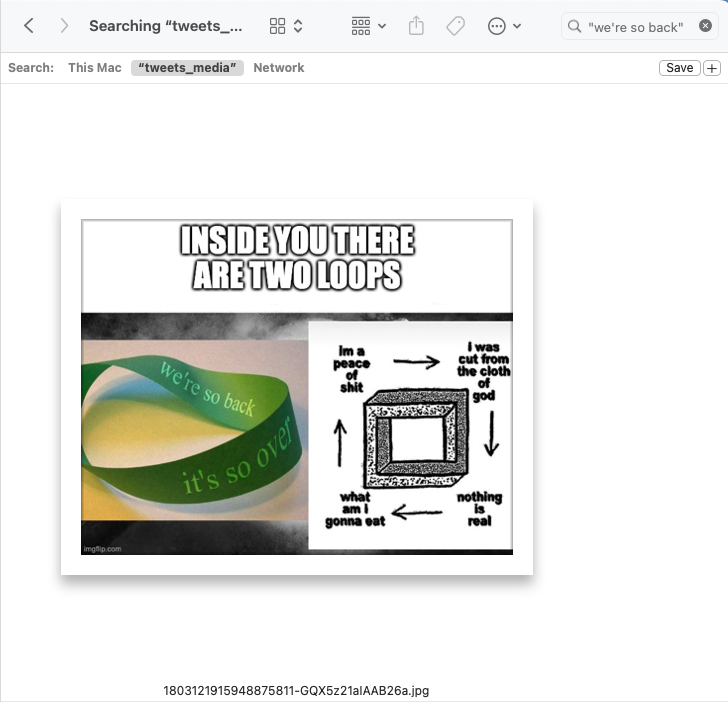

# Image Detailer

Make your images searchable on Mac, C/O ChatGPT.

## Instructions

1. `npm i`
2. `cp .env.example .env` and add your API key
3. `node recognizeAll.js PATH_TO_IMAGES`

Once it's done, you can search in Finder or Spotlight to find images based on their content.

